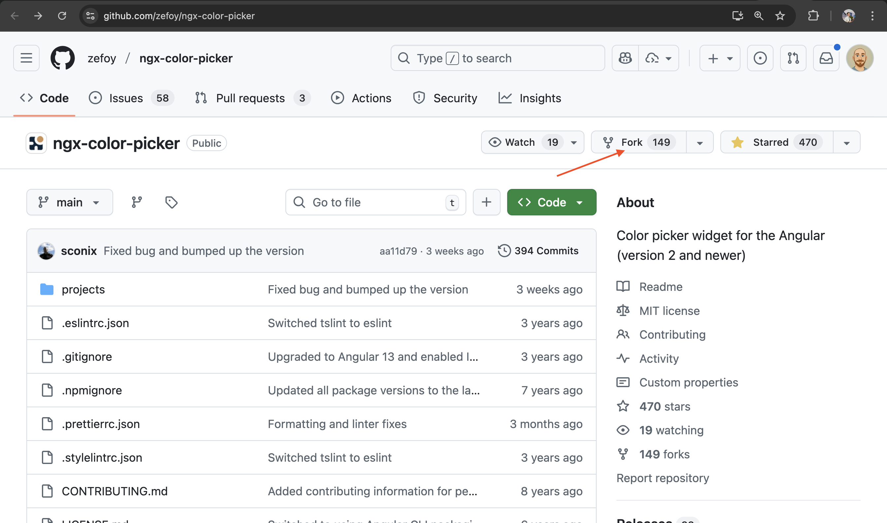
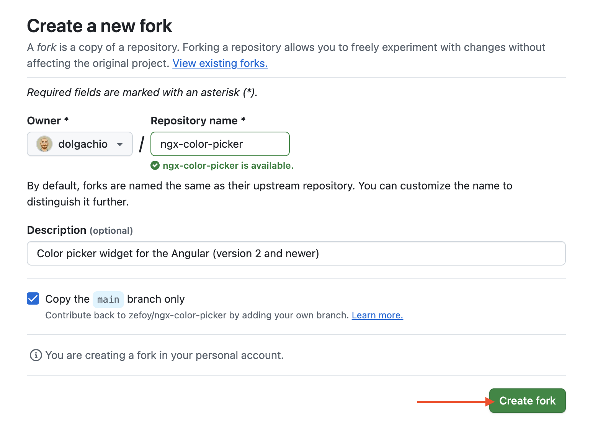
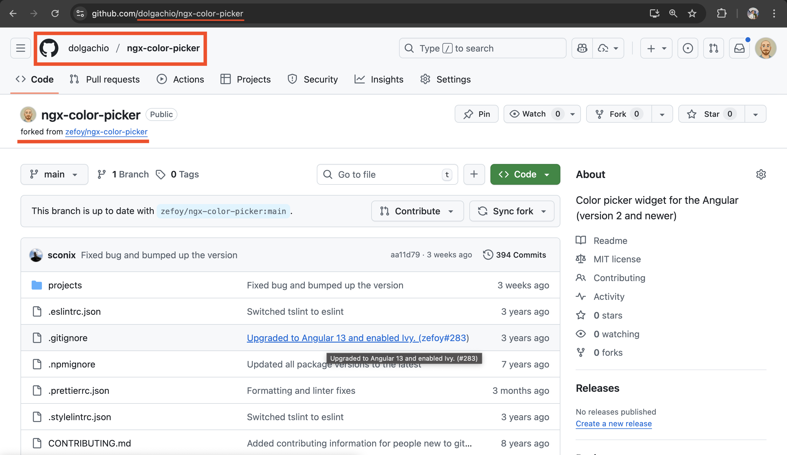

# Як робити зміни в проєктах з відкритим кодом?

Зазвичай більшість проєктів мають опис з інструкціями, як змінювати код, тому в першу чергу шукайте файли `CONTRIBUTING.md` або `contribute.md` чи `CONTRIBUTE.md`.

Проте, якщо їх немає, ви можете використовувати інструкцію нижче.

## Як зробити свій внесок до проєкта на GitHub?

### 1. Створення Форку (Fork) проєкту

**Форк (Fork)** - це копія репозиторію, яку ви створюєте у своєму `GitHub` акаунті. Ви маєте до нього повний доступ і можете вносити зміни. Більше про форк в окремому гайді: [Що таке Форк (Fork)?](./lib/fork.md).

1. Створіть або увійдіть в свій акаунт на `GitHub`.
2. Відкрийте сторінку проєкту і **зробіть його форк**.  
    Для створення натисніть кнопку **Fork** у правому верхньому куті:
    
    Якщо все добре, то з'явиться інший екран:
    
    Жміть зелену кнопку в правому нижньому куті, і форк готовий.
3. Після цього має відкритися сторінка вашого форку. Може здатися, що нічого не змінилося, і ви все ще на оригінальній сторінці проєкту, але ні - це **ваш особистий форк оригінального репозиторію**. **Зверніть увагу на адресу і написи зверху**:
    

    Далі ви будете працювати саме з форком, а не оригінальним репозиторієм.

