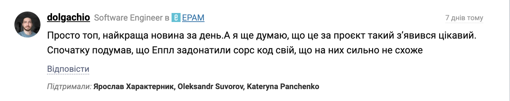

# Вихідний код вебверсії App Store: Apple завдає удар у відповідь

Минулого тижня, `Apple` розкрила вихідний код нового вебсайту `App Store`. Про це писали всі окрім мене, починаючи від [Dou](https://dou.ua/forums/topic/56417/)  закінчуючи [TechRadar](https://www.techradar.com/pro/security/want-to-take-a-look-at-apples-development-secrets-it-accidentally-leaked-its-entire-front-end-source-code-for-its-new-app-store-which-is-now-available-for-anyone-to-view-for-now). Проте, на цьому історія не закінчилась.

## Як це технічно відбулося?

Розробники `Apple` допустили помилку: **вони випадково опублікували сорс мапи (source maps) для свого коду**. 

_Технічне пояснення_: **[сорс мапи (source maps)](https://developer.mozilla.org/en-US/docs/Glossary/Source_map)** — це файли, які дозволяють розробникам бачити вихідний код через інструменти розробника в браузері. Зазвичай код в вебі публікується **мінімізованим і обфускованим**, і там мало, що можна зрозуміти, тому їх і використовують підчас налагодження коду. Але це не просто інструмент розробки,  маючи сорс мапи, **можна легко відновити вихідний код повністю: структуру файлів, імена змінних, коментарі, залежності тощо**.

Тому, коли це відбулося з `App Store`, одразу знайшлись люди, які витягнули вихідний код з сорс мапів і **почали публікувати його на GitHub через свої аккаунти** І тут починається найцікавіше, бо юридично код не стає опен-сорс від того, що ви його випадково отримали. Ба більше, цей код все одно належить `Apple`, і розповсюджувати його без дозволу компанії заборонено.

## Apple відповідає

І от, Apple почала діяти. З блискавичною швидкістю в той самий день, **GitHub на запит Apple видалив**, увага: [8,270(!) репозиторіїв з вихідним кодом App Store](https://github.com/github/dmca/blob/master/2025/11/2025-11-05-apple.md). Майже усі посилання, які публікували в новинах, **вже видалені і недоступні**. Я про це випадково дізнався, коли мій колега спитав чи не встиг я склонувати один з таких репозиторіїв, бо він вже видалений.

Проте, як ми всі знаємо, **в інтернеті нічого не зникає назавжди**. І хоча більшість репозиторіїв вже видалені, їх продовжують створювати наново. **Їх дуже легко знайти**, шукаєете на `GitHub` за ключовим словом `apps.apple.com` і сортуєте за `'Recently Updated'`. Якщо я зміг знайти, то ви теж зможете.

## Що мене бентежить?

Напочатку мені було весело, і я навіть написав коментар:

Проте, зараз мене бентежать дві речі:

1. **Етичність розповсюдження коду Apple**. 

    Наскільки ок публікувати код, який ми отримали випадково? Я розумію, що до `Apple` є багато питань, але чи варто порушувати їхні права інтелектуальної власності? Мені особисто було б супер некомфортно, якби хтось так зробив з моїм кодом, думаю як і вам. 

2. **Кому належить код опублікований на `GitHub`?** 

    Уявімо, я створив проєкт і залив його на `GitHub`. Чи це мій код? Хочеться відповісти, що так, але чи може `GitHub` видалити його без мого дозволу за запитом якоїсь компанії? А якщо це популярний проєкт з багатьма зірочками і форками?

    В ситуації з `Apple`, проте як це працює? Які докази має надати компанія, щоб `GitHub` видалив репозиторій? Чи може `GitHub` просто довіритись компанії без перевірки? Мені особисто дуже ніяково, після цього. Можливо, нам треба думати почати самім хостити свої проєкти? Наприклад, як от описано тут [GitHub Ensloppification](https://dbushell.com/2025/08/11/github-ensloppification/).

## Підсумки

Як на мене це показовав історія, яка ще не завершилась. Вона піднімає багато питань про **етику**, **права інтелектуальної власності** і роль платформ як `GitHub` у регулюванні контенту. Раніше мені здавалось, що подібна модерація може відбуватись лише в соціальних мережах, але ніт. Можливо я занадто сильно себе накрутив, але післясмак так собі. А ви що думаєте з цього приводу?
